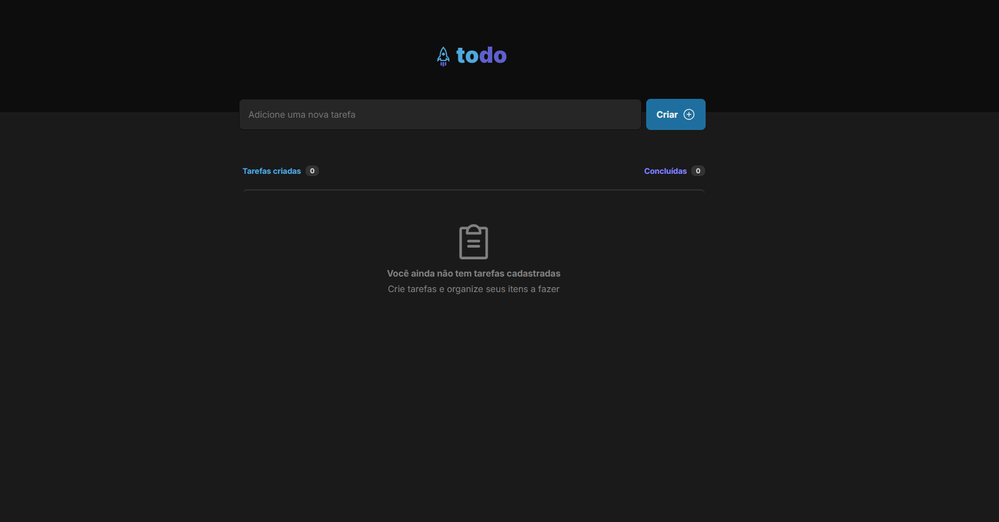

# To-Do

## 🦾 Tecnologias

- ViteJS
- ReactJS
- TypeScript
- eslint
- phosphor-icons

## ⚙️ Sobre o projeto

- Foi feita uma aplicação junto a NLW AI da RocketSeat que visa usar o Xenova de inteligência artificial para baixar vídeos dos shorts, converter para áudio e fazer a transcrição do video e também resumo do vídeo, sendo assim conseguindo fazer resumo de todos os shorts desejados

## ❤️ Contato

julionev@gmail.com
